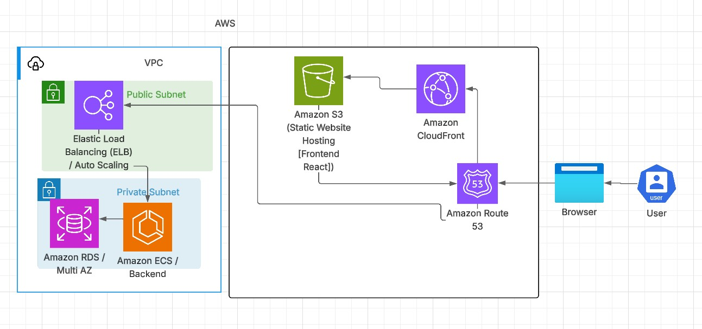

# Reto de Arquitectura Cloud: Aplicación Web Escalable en AWS
## Escenario

Una startup quiere lanzar una aplicación web interna para 50–100 usuarios activos diarios, con posibilidad de crecer a 1000 usuarios en el futuro. La app será un sistema de inventario con backend en Django y frontend en React.

## Quieren que la infraestructura sea:

Alta disponibilidad

Escalable automáticamente

Segura y monitoreada

Costo-efectiva

## Requisitos Técnicos

### Frontend

Desplegar React en un bucket S3 con hosting estático.

Servirlo a través de CloudFront con HTTPS (ACM para el certificado).

### Backend

Django servido con Gunicorn en contenedores Docker.

Ejecutándose en ECS con Fargate (serverless containers).

Balanceado con Application Load Balancer (ALB).

### Base de Datos

RDS PostgreSQL en Multi-AZ.

Backups automáticos habilitados.

### Seguridad

Todo el tráfico HTTPS forzado con ACM + ALB + CloudFront.

Acceso restringido a la DB (solo desde ECS).

Roles IAM mínimos necesarios.

### Escalabilidad

Auto Scaling en ECS con base en CPU y memoria.

Posibilidad de manejar picos de tráfico.

### CI/CD

Pipelines en GitHub Actions para:

Testear código.

Construir imágenes Docker.

Push a ECR.

Desplegar automáticamente a ECS.

### Monitoreo y Logs

Logs en CloudWatch (app + ECS + ALB).

Alarmas en métricas críticas (latencia alta, CPU/RAM, DB).

### Retos
Diseñar el diagrama de arquitectura con todos los componentes.

Explicar el flujo (desde que un usuario entra a la app hasta que recibe respuesta).

Justificar las decisiones de diseño (ej: por qué Fargate en lugar de EC2, por qué RDS en Multi-AZ, etc.).

Proponer optimizaciones de costo para la etapa inicial (pocos usuarios).
## Documentación

### 1. Diagrama de Arquitectura:

### 2. Explicación de Flujo de la Arquitectura:
Todo empieza cuando el usuario hace una petición a través de un nombre de dominio gestionado en Amazon Route 53.
Este dominio apunta a Amazon CloudFront, el cual entrega los archivos estáticos almacenados en un bucket de Amazon S3 que contiene la aplicación frontend en React.
El frontend, a su vez, realiza peticiones a una API REST expuesta en otro dominio gestionado por Route 53, que apunta a un Application Load Balancer (ALB) desplegado en una subnet pública dentro de la VPC.
El ALB distribuye las peticiones hacia el backend implementado en Amazon ECS con Fargate, el cual se encuentra en una subnet privada. ECS Fargate ejecuta los contenedores de la aplicación Django, y el servicio puede escalar automáticamente el número de tareas según la carga (Auto Scaling).
Cuando el backend necesita interactuar con la base de datos, se conecta a un Amazon RDS configurado en Multi-AZ, que se encuentra también en subnets privadas (una en cada AZ).
La base de datos está protegida por un Security Group que solo permite acceso desde el backend, garantizando la seguridad de las comunicaciones internas.

### 3. Justificación:
Amazon Route 53 es el servicio de DNS de AWS que permite gestionar nombres de dominio y resolverlos hacia diferentes recursos. En este caso, necesito dos dominios: uno para el frontend y otro para el backend. Route 53 me ofrece integración nativa con otros servicios de AWS, lo que lo hace ideal para este escenario.

Amazon S3 es el servicio de almacenamiento óptimo para archivos estáticos como los generados por mi aplicación React (HTML, CSS y JS). S3 me permite servir estos archivos de manera segura, escalable y con alta disponibilidad, sin necesidad de servidores adicionales.

Amazon CloudFront actúa como red de entrega de contenido (CDN), distribuyendo los archivos de mi bucket S3 con baja latencia a usuarios globales. Además de mejorar el rendimiento, incrementa la seguridad al manejar HTTPS y restringir accesos directos al bucket.

Amazon VPC es fundamental para aislar recursos y controlar el tráfico. Al usar subnets públicas y privadas, puedo garantizar que solo los recursos que necesitan acceso directo desde internet (como el ALB) estén expuestos, mientras que el backend y la base de datos se mantienen protegidos en subnets privadas.

Application Load Balancer (ALB) recibe las peticiones HTTP/HTTPS en la subnet pública y las distribuye hacia los contenedores del backend que viven en subnets privadas. Esto asegura seguridad y flexibilidad. Junto con ECS Service Auto Scaling, el backend puede escalar dinámicamente según la carga de trabajo.

Amazon ECS con Fargate me permite desplegar el backend en contenedores sin administrar servidores. Es una solución serverless para contenedores: solo defino la imagen, recursos y políticas de escalado, y AWS gestiona la ejecución.

Amazon RDS Multi-AZ proporciona una base de datos relacional gestionada, con backups automáticos, parches y alta disponibilidad. Al habilitar Multi-AZ, AWS crea automáticamente una réplica en otra zona de disponibilidad y gestiona el failover, lo que garantiza resiliencia y continuidad del servicio.

### 4. Documentación:

#### 1. VPC:
El recurso VPC es donde estrán alojados algunos recursos, en este caso tenemos dos zonas de disponibilidad, cada az tiene dos subnets (pública y privada). Por lo tanto dentro de la VPC tenemos 4 subnets en dos diferentes zonas de disponiblidad. Las subnets públicas necesitan de acceso a internet, por lo cual se configura un Internet Gateway y una tabla de rutas que se asocia a cada subnet pública de las dos zonas de disponibilidad. El código de la infraestructura se encuentra en: /terraform/modules/vpc
#### 2. Security Groups:
Para una arquitectura segura debemos implementar las políticas de comunicación entre recursos, empezando por el sg de mi alb que esta en la subnet pública y recibe trafico por HTTP y HTTPS de todo tráfico entrante, este esta en /terraform/modules/security-group-alb.
Por otro lado tenemos es security group para el backend servido por el servicio ECS, este tiene reglas de entrada que permitan solo tráfico proveniente de mi ALB a través de su security group que definimos anteriormente, y reglas de salida que permita todo tráfico saliente. El recurso esta en: /terraform/modules/security-group-ecs
Por último se creó el security group para mi recurso RDS que solo permite tráfico entrante del recurso ECS por medio de su security group, a su vez permite todo tráfico saliente para uso de RDS como servicio. El recurso esta en: /terraform/modules/security-group-rds
#### 3. RDS:
Para la base de datos definimos usar el servicio RDS, en este caso configuramos el nuestro para que trabajé en dos diferentes zonas de disponibilidad (az), con un recurso de subnet_group para decirle a rds en que subnets se alojará, subnets las cúales ya configuramos anteriormente en VPC, esta base de datos es mas para un entorno de pruebas por lo cúal lo cree sin algunas cosas como snapshot, password entre otros. A su vez definimos dos outputs que exponen el puerto y el endpoint de la db. El recurso se encuentra en: /terraform/modules/rds
#### 4. ALB:
El módulo alb contiene Application Load Balancer como recurso, y este cumple la funcion de recibir el tráfico en las subnets públicas y reenviarlo a nuestro servicio de ECS, tenemos configurado un alb con un "listener" escuchando en el puerto 80 [HTTP en este caso]. Por otro lado configuramos un target group con ip ya que usamos ecs con Fargate. El servicio ecs crea tareas (contenedores) según la configuración, y los registra en los target group configurado en nuestro alb, que al recibir las peticiones en el puerto 80, este las redirige a las ips de las tareas registradas en el target group. El módulo esta en : /terraform/modules/alb.